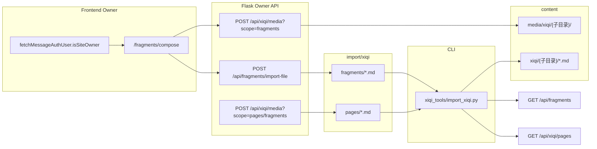

# 碎念站长撰写与后端 import 方案

## 目标与约束

- **权限**：复用现有留言 OAuth session（[`messageAuth.ts`](frontend/src/services/messageAuth.ts) + [`site_owner.py`](backend/app/site_owner.py)），仅 `isSiteOwner` 可见撰写入口。
- **发布流程（你已选定）**：API **只写文件**（`import/xiqi/**` + 媒体），**不自动 upsert DB**；站长本地执行 import 脚本后，前台 `GET /api/fragments` 才可见。
- **存储原则**：与 [`friend_link`](backend/import/friend_link/) / [`import_markdown_posts.py`](backend/scripts/content_tools/import_markdown_posts.py) 一致——**Git 管理的 import 源 + 运行时 content + MySQL 索引**。
- **栖息目录约定（新增）**：**所有**栖息相关 Markdown 与媒体，统一放在 **`xiqi` 根目录**下，并按页面/用途建立**对应子目录**（如碎念 → `fragments`）。

---

## 〇、栖息（xiqi）统一目录树

### Import 源（Git 管理，`backend/import/xiqi/`）

```
backend/import/xiqi/
├── _template/                    # 全局模板（不参与扫描）
│   ├── fragment.template.md
│   └── page.template.md        # Hero / 页面元数据
├── fragments/                    # 碎念 import Markdown（一层 *.md）
│   └── frag-xxx.md
├── pages/                        # 三页 Hero / 页面级配置 import
│   ├── fragments.md              # page: fragments + hero_image_url
│   ├── about.md
│   └── recommend.md
├── about/                        # 关于页正文 import（占位，后续扩展）
└── recommend/                    # 推荐页正文 import（占位，后续扩展）
```

- 各子目录扫描规则与友链一致：**仅该目录根层** `*.md`，跳过 `_` 前缀；`_template/` 不扫描。
- 新增栖息页面时：在 `import/xiqi/` 下**新建同名子目录** +（如需 Hero）在 `pages/` 增加配置 md。

### 运行时媒体（`backend/content/media/xiqi/`）

**所有**栖息媒体（image / gif / video 等）均在此树下，URL 前缀统一为 `/api/media/files/xiqi/...`：

```
backend/content/media/xiqi/
├── fragments/                    # 碎念配图、封面
│   └── {uuid}.jpg|.png|.webp|.gif|.mp4|...
├── pages/                        # 三页 Hero 背景
│   ├── fragments/
│   ├── about/
│   └── recommend/
├── about/                        # 关于页专用媒体（预留）
└── recommend/                    # 推荐页专用媒体（预留）
```

- 站长上传 API 按 **目标子目录** 写入（如碎念 → `media/xiqi/fragments/`；Hero → `media/xiqi/pages/fragments/`）。
- 与现有 [`upload_media.py`](backend/scripts/media_tools/upload_media.py) 一致：DB `media` 表可选登记；碎念 front matter 以 URL 字符串为准。

### 运行时 Markdown 正文（`backend/content/xiqi/`）

import 脚本将 `---` 后正文落盘到与 import 子目录**镜像**的路径：

```
backend/content/xiqi/
├── fragments/
│   └── {public_id}.md            # 碎念正文 Markdown
├── about/                        # 预留
└── recommend/                    # 预留
```

- DB `fragment.md_url` 存相对路径：`xiqi/fragments/{public_id}.md`（相对 `CONTENT_ROOT`）。



---

## 一、数据模型与文件约定

### 1.1 碎念 Markdown（`backend/import/xiqi/fragments/`）

参考 [`friend_link.template.md`](backend/import/friend_link/_template/friend_link.template.md)：

```yaml
---
public_id: frag-20260524-a1b2c3d4
mood: rant | sketch | flash | daily
status: published | hidden | draft
created_at: '2026-05-24T21:30:00'
images:
  - url: /api/media/files/xiqi/fragments/abc.jpg
    alt: 夜空与星点
cover_index: 0
---
正文 Markdown，支持 `` inline 图。
```

- **import 路径**：`import/xiqi/fragments/{public_id}.md`
- **正文落盘**：`content/xiqi/fragments/{public_id}.md`
- **列表卡片封面**：`cover_index` → `images[cover_index]` → `XiqiCard` 单张 `coverSrc`

### 1.2 栖息页面 Hero（`backend/import/xiqi/pages/`）

例如 `pages/fragments.md`：

```yaml
---
page: fragments
hero_image_url: /api/media/files/xiqi/pages/fragments/hero.jpg
hero_image_alt: ''
status: published
---
```

- Hero 媒体目录：`content/media/xiqi/pages/{page}/`
- import 脚本 upsert `xiqi_page` 表；`GET /api/xiqi/pages/:page` 返回
- 替换 [`xiqiHeroMedia.ts`](frontend/src/theme/xiqiHeroMedia.ts) 打包图

### 1.3 MySQL（`backend/sql/fragment.sql` + `xiqi_page.sql`）

**`fragment`**：

| 列 | 说明 |
|----|------|
| `public_id` | UNIQUE，对外 `id` |
| `mood` | ENUM |
| `status` | published/hidden/draft |
| `md_url` | `xiqi/fragments/{public_id}.md` |
| `images` | JSON `[{url, alt}]` |
| `cover_index` | INT，默认 0 |
| `summary` | 列表摘要 |
| `created_at` | DATETIME |

**`xiqi_page`**：`page` PK、`hero_image_url`、`hero_image_alt`、`status`、`updated_at`

---

## 二、后端实现

### 2.1 解析与 import 脚本

| 模块 | 路径 |
|------|------|
| 碎念解析 | [`backend/app/fragment_md.py`](backend/app/fragment_md.py) |
| 页面/Hero 解析 | [`backend/app/xiqi_page_md.py`](backend/app/xiqi_page_md.py) |
| 序列化 | [`backend/app/fragment_serialize.py`](backend/app/fragment_serialize.py) |
| **统一导入** | [`backend/scripts/xiqi_tools/import_xiqi.py`](backend/scripts/xiqi_tools/import_xiqi.py) |
| 模板 | `import/xiqi/_template/`、`import/xiqi/fragments/_template/`（可选） |
| 文档 | `backend/scripts/xiqi_tools/README.md` |

**`import_xiqi.py` 子命令**（默认目录均 under `import/xiqi/`）：

```bash
python scripts/xiqi_tools/import_xiqi.py fragments          # import/xiqi/fragments/
python scripts/xiqi_tools/import_xiqi.py fragments --id frag-xxx
python scripts/xiqi_tools/import_xiqi.py pages                # import/xiqi/pages/
python scripts/xiqi_tools/import_xiqi.py --dry-run
```

### 2.2 站长写 API（`xiqi_admin_api.py` 或 `fragments_admin_api.py`）

| 方法 | 路径 | 行为 |
|------|------|------|
| POST | `/api/xiqi/media` | `?scope=fragments` 或 `pages/fragments` 等 → 存 `content/media/xiqi/{scope}/` |
| POST | `/api/fragments/import-file` | 写 `import/xiqi/fragments/{public_id}.md` |
| POST | `/api/xiqi/pages/import-file` | 写 `import/xiqi/pages/{page}.md` |

响应提示：`python scripts/xiqi_tools/import_xiqi.py fragments`（及 `pages`）。

### 2.3 公开读 API

| 方法 | 路径 |
|------|------|
| GET | `/api/fragments` |
| GET | `/api/fragments/<public_id>` |
| GET | `/api/xiqi/pages/<page>` |

---

## 三、前端实现

（与前一版相同，路径/API 对齐 `xiqi` 目录约定）

- [`FragmentsView.vue`](frontend/src/views/FragmentsView.vue)：站长「撰写碎念」→ `/fragments/compose`
- [`FragmentComposeView.vue`](frontend/src/views/FragmentComposeView.vue)：Markdown + 拖拽插图 + 封面选择 + `XiqiCard` 预览
- 上传调用 `POST /api/xiqi/media?scope=fragments`
- [`XiqiPageHero.vue`](frontend/src/components/xiqi/XiqiPageHero.vue)：`GET /api/xiqi/pages/:page`

---

## 四、关键交互说明

| 需求 | 实现要点 |
|------|----------|
| 栖息媒体统一 | 全部 under `content/media/xiqi/{子目录}/` |
| 栖息 Markdown 统一 | import → `import/xiqi/{子目录}/`；正文 → `content/xiqi/{子目录}/` |
| 卡片单图 + 可选封面 | `cover_index` + 预览 |
| 正文 Markdown | 详情 `bodyHtml` |
| 拖拽插图 | caret 插入 + `images[]` |
| 仅站长 | OAuth `isSiteOwner` + API 403 |

---

## 五、实施顺序

1. 创建 `import/xiqi/`、`content/xiqi/`、`content/media/xiqi/` 目录树 + SQL
2. `import_xiqi.py` + 示例 md
3. GET API + 前台列表/详情
4. 站长 upload + import-file API
5. FragmentComposeView
6. Hero pages import/API
7. README / run.md

---

## 六、不在本期范围

- 编辑/删除碎念 UI（改 import md + 重跑脚本）
- 访客投稿与审核
- 全功能 WYSIWYG
