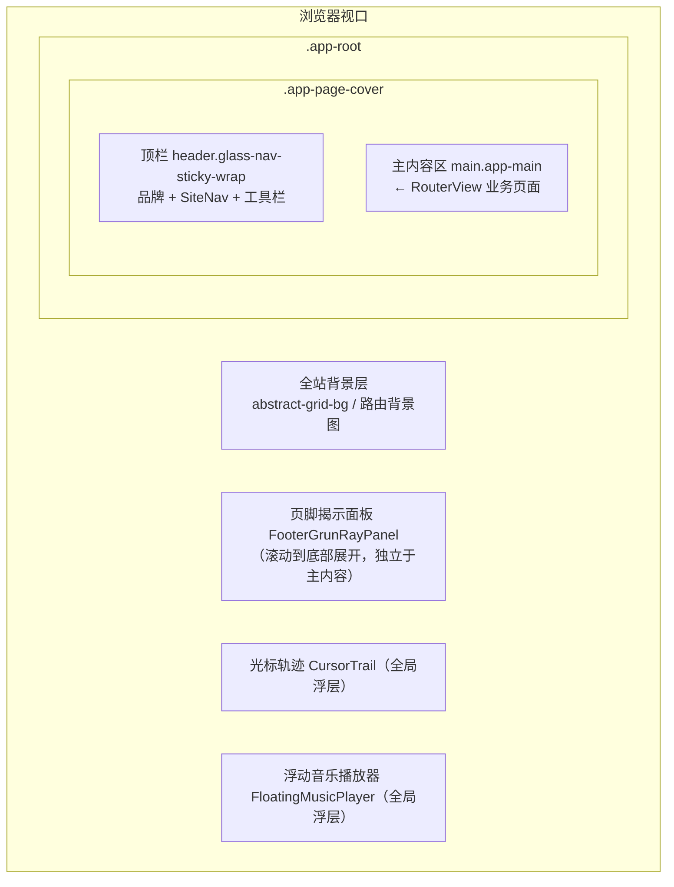
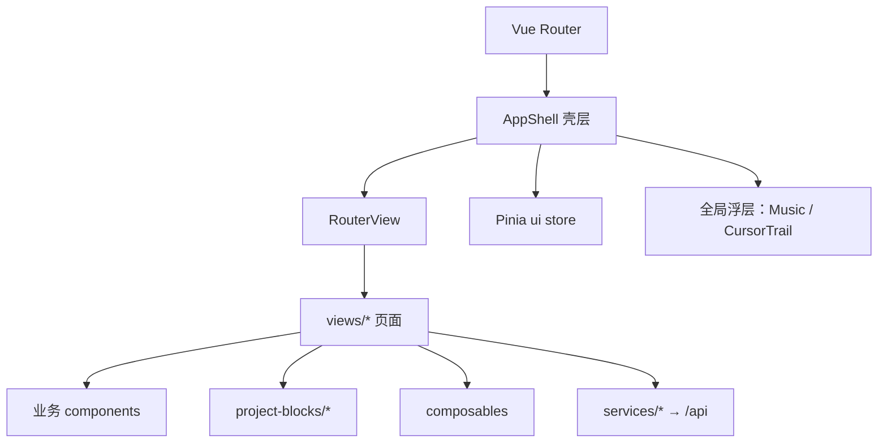
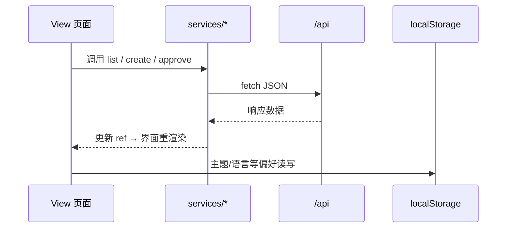

# GrunRay Wiki — 项目讲解指南（单人 · 前端侧重）

> **用途**：答辩视频、课堂展示时的**口头讲解提纲**（由汇报人独立完成全程演示）。  
> **讲解重心**：**前端架构、界面区域划分、页面布局模式、Vue 组件与 CSS 视觉体系**；后端仅作为数据来源一笔带过。  
> **关联文档**：[要求.md](./要求.md) · [报告.md](./报告.md) · [GrunRay_wiki-大作业对照分析.md](./GrunRay_wiki-大作业对照分析.md)

---

## 如何使用本文档

| 场景 | 建议用法 |
|------|----------|
| **10–15 分钟答辩** | 按 [§二 推荐讲解顺序](#二推荐讲解顺序约-1015-分钟) 走完全程；**界面细节以 [§三附](#三附各页面界面分区与实现详解) 为主** |
| **5 分钟速讲** | §三 开场 → §三附 B（首页胶片）+ §三附 D（项目 Demo）→ §十三 总结 |
| **被追问技术细节** | 查阅 [§十二 问答预案](#十二问答预案) |

讲解前请确认：`npm run dev` 已启动，浏览器能加载 `/api` 数据（后端需提前跑起来，汇报时不必展开讲后端实现）。

---

## 一、项目一句话定位（前端视角）

**GrunRay Wiki** 是一个 **Vue 3 + TypeScript 单页应用**：用统一的 **AppShell 壳层** 承载 15 个业务视图，通过 **Vue Router 嵌套路由** 切换内容区；界面为 **自研 CSS 主题体系**（无 Element Plus），按页面类型分为 **全屏沉浸、时间轴列表、分栏滑入、标准卡片** 四种布局模式；业务数据经 `services/*` 调用 REST API，用户偏好（主题、语言、音乐等）写入 **localStorage**。

**答辩时可强调的前端亮点**：

1. **壳层 + 子路由**：顶栏/工具栏/页脚固定，`<RouterView>` 只换主内容区  
2. **数据驱动项目详情**：`layout` 块注册表 + iframe Demo 嵌入  
3. **分页面入场动画**：每类页面独立 `page-enter-*.css`，composable 统一调度  
4. **完整前端交互**：表单校验、列表筛选排序、骨架屏、Toast、OAuth 分支 UI  

---

## 二、推荐讲解顺序（约 10–15 分钟）

| 顺序 | 章节 | 建议时长 | 侧重点 |
|------|------|----------|--------|
| 1 | 开场：选题与前端技术栈 | 1 min | Vue 3 / Router / Pinia / 自研 CSS |
| 2 | **全站界面区域划分** | 1.5 min | AppShell 各区块、导航分组 |
| 3 | **四种页面布局模式** | 1.5 min | 对照浏览器切换不同路由 |
| 4 | 壳层交互：主题 / 工具栏 / 页脚 | 2 min | Pinia + CSS 变量 + FLIP 动画 |
| 5 | 首页界面结构 | 1 min | FilmFeed、全屏 meta |
| 6 | 项目详情与 Demo 块（重点） | 2.5 min | project-blocks、iframe |
| 7 | 时间轴类页面（项目/博客） | 1.5 min | 筛选栏 + 时间轴 Grid |
| 8 | 表单类页面（留言/友链） | 1.5 min | 校验、验证码、列表 UI |
| 9 | 扩展界面（碎语分栏 / 404 / 音乐） | 1 min | XiqiSplitLayout、故障主题 |
| 10 | 前端数据流与工程结构 | 1 min | services / composables / types |
| 11 | 总结与不足 | 0.5 min | |

---

## 三、开场白（可直接念）

> 各位老师好，我的项目叫做 **GrunRay Wiki**，是一个个人 Wiki 与作品集站点的前端应用。  
>  
> 从**前端课程**的角度，这个项目主要实践了：**Vue 3 组合式 API 的组件化拆分**、**Vue Router 多页面路由**、**Pinia 全局 UI 状态**、以及 **CSS3 Flex/Grid 布局与主题变量体系**。界面没有使用第三方 UI 组件库，而是由 `styles/` 下的主题 token 和分页面样式文件统一视觉。  
>  
> 数据方面，前端通过 `fetch` 调用 `/api` 接口获取项目、文章、留言等内容；用户偏好如主题、语言、音乐播放器状态则存在 **localStorage**。下面我会按页面逐个介绍：**每个区域显示什么、用来做什么、以及前端是怎么实现的**——先从首页的三栏布局和右侧胶片流讲起。

**提交前替换**：姓名、学号。

---

## 三附、各页面界面分区与实现详解

> 本节是汇报的**主体内容**：按「界面上有什么 → 用来做什么 → 前端怎么实现」逐项说明。建议边讲边在浏览器里对照演示。

---

### A. 全站壳层 `AppShell`（所有页面共用）

用户打开任意路由，看到的**固定外框**都由 `AppShell.vue` 渲染，中间 `<RouterView />` 才换成具体业务页。

| 界面区域 | 类名 / 组件 | 作用 | 实现要点 |
|----------|-------------|------|----------|
| **顶栏左侧** | `.header-left` | 品牌名 `GrunRay` + 主导航 | `RouterLink` 回首页；`SiteNav` 渲染分组导航 |
| **顶栏右侧** | `.header-right` | 主题、背景图、轨迹、音乐、语言、溢出菜单 | 按钮过多时收进 `.nav-overflow-panel`；启用工具时用 **FLIP 动画**从面板「飞到」顶栏槽位（`useHeaderToolbarLayoutShift.ts`） |
| **主导航** | `SiteNav` | 页面跳转 | 首页直链 + 三个下拉组（创作 / 社区 / 栖息），`SiteNavGroup` 渲染图标+标题+描述 |
| **主内容** | `main.app-main` | 业务页面出口 | 子路由组件在此挂载；部分路由加 `app-main--full-viewport` 占满视口 |
| **页脚揭示** | `FooterGrunRayPanel` | 滚到底展开品牌信息 | `useFooterGrunRayReveal.ts` 监听滚动，控制面板展开 |
| **光标轨迹** | `CursorTrail` | 鼠标拖尾装饰 | GSAP 驱动，Pinia `cursorTrailEnabled` 控制开关 |
| **音乐播放器** | `FloatingMusicPlayer` | 全局 BGM | `position: fixed` 浮层，拖拽位置与播放状态写 localStorage |

**滚动 compact**：`useNavScrollCompact` 监听滚动，顶栏 `data-nav-compact="true"` 时高度收窄，给主内容让出空间。

---

### B. 首页 `/` — 三栏布局 + 胶片流

首页是汇报时**最值得细讲**的页面：`.home-layout` 用 **CSS Grid 三列**（`grid-template-columns: repeat(3, 1fr)`）把界面分为左、中、右三个功能区；窄屏（`≤1100px`）改为 **Flex 纵向堆叠**：中间个人区 → 左侧文章 → 右侧胶片。

```
┌─────────────────────────────────────────────────────────────┐
│  [顶栏 AppShell]                                             │
├──────────────┬─────────────────────────┬────────────────────┤
│ 左栏         │ 中栏 center              │ 右栏 right-panel   │
│ left-ellipse │                         │                    │
│              │  ┌─────────┐              │  ┌──────────────┐  │
│ 最新三篇     │  │ 圆形头像 │              │  │ FilmFeed     │  │
│ 文章卡片     │  └─────────┘              │  │ 胶片容器     │  │
│              │  问候语 card               │  │              │  │
│ 随机推荐     │  实习说明 card             │  │ ○ 孔洞       │  │
│ 文章卡片     │  自我介绍 card             │  │ ┃ 画面轨     │  │
│              │  （技术栈+文案）           │  │ ┃ 向上滚动   │  │
│              │                         │  │ ○ 孔洞       │  │
└──────────────┴─────────────────────────┴────────────────────┘
```

#### B.1 左栏 `.left-ellipse`（文章推荐区）

| 区块 | 作用 | 数据来源与实现 |
|------|------|----------------|
| **最新三篇文章** `.left-latest-panel` | 展示最近更新的博客，点击进详情 | `fetch('/api/posts/latest-updated')`；`RouterLink` 到 `/blog/:slug`；结果缓存在 `sessionStorage` |
| **随机推荐** `.left-random-panel` | 展示一篇随机推荐文章 | `fetch('/api/posts/random-recommend')`；同样可点击跳转 |
| 卡片内容 | 标题、标签、摘要、更新日期 | `v-for` 列表渲染；无数据时显示空状态卡片 |

左栏外观：玻璃拟态卡片（`backdrop-filter: blur` + `var(--glass-card-bg)`），固定最大宽度约 380px。

#### B.2 中栏 `.center`（个人展示核心区）

| 区块 | 作用 | 实现 |
|------|------|------|
| **圆形头像** `.avatar` | 站点主视觉 | `aspect-ratio: 1/1` + `border-radius: 50%`；图片从 `/api/media/list?folder=film/homeView/center/avatar` 拉取；加载前用 `AvatarCircleSkeleton` 占位 |
| **问候语** `.greeting-art` | 展示 `home.greeting` 文案 | `vue-i18n`；衬线字体 `Playfair Display` |
| **实习说明** `.internship-note` | 一行提示信息 | `home.internshipNote` 文案 |
| **自我介绍** `.self-intro-box` | 技术栈格子 + 个人简介 | 内部 `grid` 两列：左为「技术栈 Languages」趣味列表，右为长文案；内容区可纵向滚动 |

页面进入时：`onMounted` 调用 `playPageEnter(homeRoot)`，配合 `page-enter-home.css` 做入场动画。

#### B.3 右栏 `.right-panel` — 胶片流 `FilmFeed`（重点）

**界面外观**：一个竖长的「电影胶片」容器——左右两侧各一列 **穿孔圆角小方块**（`.holes` / `.hole`，模拟胶片齿孔），中间是 **画面轨道**（`.track`），上下有半透明 **边缘遮罩**（`.film-edge-overlay`）营造胶片暗角。

**里面有什么**：一张张图片或短视频（`img` / `video`），来自接口 `GET /api/media/list/filmfeed`，最多 50 条，类型字段区分 `image` / `gif` / `video`。

**用来做什么**：

1. **氛围展示**：循环滚动展示生活照、项目截图等媒体，让首页不只有文字。  
2. **可交互**：鼠标滚轮在胶片区域滚动可 **调节播放速度**（`speedSeconds` 在 6–40 秒之间）；点击某一帧打开 **全屏灯箱**（`.viewer`）放大查看；按 `Esc` 关闭。  
3. **悬停反馈**：轨道滚动时非悬停帧轻微模糊缩小，悬停帧放大高亮。

**怎么实现（前端）**：

| 步骤 | 实现 |
|------|------|
| 数据加载 | `onMounted` → `fetch('/api/media/list/filmfeed')` → `items` 数组 |
| 无缝循环 | `loopItems = [...items, ...items]` 复制一份，轨道总高为两倍 |
| 滚动动画 | `.track` 上 `@keyframes scroll`：`translateY(0)` → `translateY(-50%)`，`animation: scroll linear infinite`；时长由 `animationDuration: speedSeconds` 动态绑定 |
| 滚轮调速 | `@wheel.prevent="onWheel"`，根据 `deltaY` 增减 `speedSeconds` |
| 灯箱 | `viewerItem` 非空时渲染 `position: fixed` 遮罩；打开时 `.track.paused` 暂停动画 |
| 齿孔装饰 | `v-for="n in 10"` 生成 10 个 `.hole`，纯 CSS 绝对定位 |
| 响应式 | `≤1100px` 时胶片区 `min-height: min(52vh, 520px)`，避免高度塌陷 |

**代码路径**：`views/HomeView.vue`（布局） + `components/media/FilmFeed.vue`（胶片逻辑与样式）。

---

### C. 项目列表 `/projects` — 时间轴 + 筛选

| 界面区域 | 作用 | 实现 |
|----------|------|------|
| **页头** | 标题「项目」 | `h1` + `useSeoMeta` |
| **筛选工具栏** `.toolbar` | 按标签筛选、是否含归档 | `AppSelect` 下拉；`tagFilter` 过滤 `computed timelineItems` |
| **时间轴** `.timeline` | 按年份分组展示项目 | `timelineGroups` 把项目按 `yearLabel` 分组；每组有年份标题 + 条目数 |
| **时间轴条目** `.timeline-item` | 单条项目 | **三列 Grid**：`日期列 | 圆点 | 卡片`；卡片可点击 `router.push('/projects/:slug')` |
| **加载态** | 避免白屏 | `TimelinePageSkeleton` 骨架屏 |

时间轴圆点 `.timeline-dot` 与竖线用 CSS 伪元素连接，形成「时间线」视觉效果。数据经 `contentRepository.ensureProjectsLoaded()` 拉取并缓存。

---

### D. 项目详情 `/projects/:slug` — 头图 + 信息面板 + 内容块

页面自上而下分为四段：

| 区域 | 类名 | 作用 | 实现 |
|------|------|------|------|
| 返回链 | `.back` | 回项目列表 | `RouterLink to="/projects"` |
| **头图区** | `.hero.card` | 标题、摘要、标签、归档角标 | 直接绑定 `project` 对象 |
| **上部双栏** | `.top-panels`（Grid 2 列） | 左：项目事实（周期、状态）；右：操作按钮（GitHub、项目笔记） | `dl.meta` 定义列表；`RouterLink` / `<a>` 外链 |
| **主内容区** | `.blocks` | 按 `project.layout[]` 顺序渲染多种块 | `v-for` + `ProjectBlockRenderer` |

#### 内容块系统（`project-blocks/`）

API 返回的 `layout` 是数组，每项有 `type` 字段。`registry.ts` 映射到组件：

| type | 界面表现 | 组件 |
|------|----------|------|
| `overview` | 文字概述 | `OverviewBlock` |
| `demo` | **iframe 演示区**（站中站） | `DemoBlock` |
| `gallery` | 图片网格 | `GalleryBlock` |
| `changelog` | 更新记录列表 | `ChangelogBlock` |
| `markdown` | Markdown 段落 | `MarkdownBlock` |

**Demo 块实现**：`DemoBlock.vue` 在 `.demo-shell` 内放 `<iframe sandbox="allow-scripts allow-same-origin allow-forms allow-popups">`；`src` 为构建后的 `demoUrl`，或 `srcdoc` 内联 HTML。高度 `clamp(420px, 65vh, 760px)`，保证 Demo 有足够操作空间。

---

### E. 博客列表 `/blog` — 筛选工具栏 + 时间轴

与项目列表共用「时间轴」视觉模式，但筛选更丰富：

| 界面区域 | 作用 | 实现 |
|----------|------|------|
| **工具栏** `.toolbar.card` | 集中所有筛选控件 | 两行 Flex 布局 |
| 第一行 | 标签下拉 + **分类胶囊按钮组** | `AppSelect` + `.category-group`；激活项背后有 `.category-pill-bg` 滑动高亮（算好 offset 用 `transform` 移动） |
| 第二行 | **关键词搜索框** | `v-model="keyword"`；输入后 `computed` 过滤标题/摘要/标签；命中词用 `<mark class="search-hit">` 高亮 |
| **时间轴列表** | 与项目列表同构 | 点击卡片 `router.push('/blog/:slug')`；置顶文章显示 `badge` |

列表数据 `ensurePostsLoaded()` 后可缓存在 session，返回列表不重新闪烁。

---

### F. 文章详情 `/blog/:slug` — Markdown 阅读页

| 区域 | 作用 | 实现 |
|------|------|------|
| 文章头 | 标题、分类、日期、标签 | `header` 区绑定 `post` 元信息 |
| **正文区** | 渲染 Markdown | 服务端或客户端 HTML；`markdown-reading.css` 统一排版（标题层级、代码块、引用） |
| 代码块 | 一键复制 | `useMarkdownCodeCopy` 在 `onMounted` 给 `pre code` 绑复制按钮 |
| 关联项目 | 若笔记属于某项目 | 显示返回该项目的链接 |

---

### G. 留言页 `/messages` — 表单 + Feed 双段式

页面纵向分为 **Hero → 欢迎语 → 发表区 → 列表区**：

| 界面区域 | 作用 | 实现 |
|----------|------|------|
| **Hero** `.message-hero` | 页标题与副标题 | 与友链页共用 hero 样式 |
| **欢迎语** `.message-welcome` | 站点留言说明 | `blockquote` 卡片 |
| **发表区** `.message-compose-wrap` | 写留言 | 未登录：OAuth 按钮组（GitHub/Google）；已登录：表单（正文 textarea + 字数统计 + 验证码 + 提交） |
| 字数统计 | 限制 500 字 | `computed contentLength` 实时显示 |
| 验证码行 | 防刷 | `fetchMessageCaptcha()` 拉题目；提交时带 `captcha_id` + `captcha_answer` |
| 提交反馈 | 成功/失败提示 | `submitToast` 定时消失 |
| **列表区** `.message-feed` | 展示留言 | 顶栏：标题 + 总数 + **排序按钮**（最新/最早） |
| 站长 Tab | 审核待发布留言 | `isSiteOwner` 时显示「公开 / 待审核」Tab；待审核列表可批准/拒绝/回复 |
| **留言卡片** `.message-item` | 单条留言 | 左：头像 `MessageAvatarWithProvider`；右：昵称、时间、正文、站长回复区 |

前端校验：空内容、超长、验证码未填 → 阻止提交并 Toast。数据经 `messageApi.ts` 与 `/api/messages` 交互。

---

### H. 友链 `/friends` 与申请 `/friends/apply`

#### 友链列表

| 区域 | 作用 | 实现 |
|------|------|------|
| Hero + 欢迎语 | 与留言页同结构的页头 | 复用 `.message-hero` 样式 |
| **申请入口** `.friends-apply-entry` | 跳转申请页 | `RouterLink to="/friends/apply"` |
| **特殊友链** | 旅伴/ACG 等联盟链接 | `SpecialLinkAvatar` 定制图标样式 |
| **普通友链网格** | 卡片展示各站点 | CSS Grid；卡片背景用 `--friend-cover` 变量显示站点封面；头像 `resolveFriendAvatar` 自动补 favicon |

#### 友链申请页

| 区域 | 作用 | 实现 |
|------|------|------|
| 左侧表单 | 站点名、URL、描述、邮箱、头像 URL | 各字段 `maxlength` + 提交前 `isValidUrl` / `isValidEmail` 校验 |
| **头像预览** | 根据 URL 实时预览 | `computed previewAvatar`：优先手动头像，否则 `siteFaviconUrl(url)` 抓 favicon |
| 右侧站点信息卡 | 展示本 Wiki 信息供对方互链 | `friendsSiteProfile` 配置 + API 拉取 |
| 验证码 + 提交 | 同留言逻辑 | `friendsApi.fetchFriendCaptcha` + `submitFriendApplication` |

---

### I. 碎语 `/fragments` — 栖息分栏布局 `XiqiSplitLayout`

| 界面区域 | 作用 | 实现 |
|----------|------|------|
| **Hero** `XiqiPageHero` | 页标题与说明 | 全屏页顶部 |
| **筛选条** | 情绪分类 + 排序 | 按钮组切换 `moodFilter` / `sortOrder` |
| **左侧列表** | 碎语卡片列表 | `XiqiCard` + `FragmentMoodBadge` 显示情绪标签 |
| **右侧详情轨** | 点击后滑入详情 | `XiqiSplitLayout`：`layoutSplit` 为 true 时主栏收窄、详情轨 `fixed` 滑入；关闭时保留 `detailDisplayId` 防塌陷 |
| 详情内容 | 正文 Markdown | `fetchFragmentDetail(id)` 异步加载 |

分栏过渡约 580ms，使用 `cubic-bezier(0.22, 1, 0.36, 1)` 缓动；打开分栏时 `useXiqiSplitFooter` 锁定页脚行为。

---

### J. 404 页 — 故障风互动

| 界面元素 | 作用 | 实现 |
|----------|------|------|
| 大号标题 | 显示「404」 | `corruptText()` 周期性随机替换字符，制造 glitch |
| 说明文案 | 路径不存在提示 | 同样 corrupt 抖动 |
| 全站故障层 | 整页偏色/噪点 | `setPageCorruptState(true)` → `page-corrupt.css` 挂到 `document` |
| **解锁主题** 按钮 | 彩蛋：开放第三套主题 | `ui.unlockAbstractTheme()` → localStorage |
| **应用抽象主题** | 切换到 abstract 主题并停止故障 | `ui.setTheme('abstract')` |
| **重播故障** | 已解锁用户可再看 8 秒动画 | `setInterval` + `setTimeout` 自动停止 |

---

### K. 浮动音乐播放器（全局）

不在任何 View 内，由 `AppShell` 或根组件挂载，始终 `position: fixed`。

| 界面区域 | 作用 | 实现 |
|----------|------|------|
| 唱片区 `VinylDeck` | 展示封面旋转动画 | 播放时 CSS 旋转 |
| 曲名 / 控制钮 | 播放暂停、上下曲 | `<audio>` 元素 + `tracks` 列表从 `/api/music/tracks` 拉取 |
| 音量面板 | 摇杆或滑条两种 UI | `volumeUiMode` 切换；音量写 localStorage |
| 拖拽 | 移动播放器位置 | `mousedown` / `touchstart` 记录偏移，`clampPos` 限制在视口内 |
| 顶栏联动 | 收起时顶栏显示音乐按钮 | Pinia `musicPlayerMinimized`；播放中按钮有脉动动画 |

---

### L. 界面实现共性（可向老师总结）

| 模式 | 哪些页面用到 | 技术 |
|------|--------------|------|
| **玻璃卡片** `.card` | 几乎全站 | `backdrop-filter` + CSS 变量边框/阴影 |
| **页面入场** | 各 View `onMounted` | `playPageEnter(el)` + 对应 `page-enter-*.css` |
| **骨架屏** | 列表/详情加载中 | `*Skeleton.vue` 组件，`aria-busy` |
| **SEO head** | 所有主要页面 | `useSeoMeta` composable + `@unhead/vue` |
| **i18n** | 所有可见文案 | `vue-i18n`，顶栏一键切换中英文 |
| **主题** | 全局 | `data-theme` on `<html>` + `tokens.*.css` |
| **响应式** | 全站 | 主要断点 `1100px / 720px / 640px`；首页三栏变单列 |

---

## 四、全站界面区域划分（讲解核心）

打开任意页面，向老师说明：**用户看到的界面始终由同一套壳层包裹，只有中间主内容区随路由变化**。

### 4.1 纵向分区示意图



### 4.2 顶栏（header）左右分区

| 区域 | DOM / 组件 | 界面内容 |
|------|------------|----------|
| **左侧** | `.header-left` | 品牌链接 `GrunRay` + **SiteNav 主导航** |
| **右侧** | `.header-right` | 主题切换、背景图、光标轨迹、音乐、语言、**溢出菜单** |

**主导航分组**（`SiteNav.vue`）——讲解时指着顶栏说：

| 导航项 | 类型 | 子页面 |
|--------|------|--------|
| 首页 | 单链接 | `/` |
| **创作** | 下拉分组 | `/projects` 项目 · `/blog` 博客 |
| **社区** | 下拉分组 | `/messages` 留言 · `/friends` 友链 |
| **栖息** | 下拉分组 | `/fragments` 碎语 · `/about` 关于 · `/recommend` 推荐 |

下拉菜单由 `SiteNavGroup.vue` 实现，每项带图标 + 标题 + 描述两行文案。

### 4.3 主内容区（main.app-main）

- 默认：居中卡片式内容，上下留白，随壳层滚动。  
- 带 `meta.appMainLayout: 'full-viewport'` 的路由：主内容区**占满视口高度**，用于首页、碎语、关于等沉浸页。  
- 路由切换后 `scrollBehavior` 回顶；`afterEach` 钩子切换**页面背景图**与 **404 故障视觉态**。

### 4.4 全局浮层组件（不在 RouterView 内）

| 组件 | 作用 | 界面表现 |
|------|------|----------|
| `FloatingMusicPlayer` | 音乐播放 | 右下角可拖拽卡片，顶栏有音乐按钮联动 |
| `CursorTrail` | 光标轨迹 | 鼠标移动时字符拖尾（可关） |
| `SplashWoniuOverlay` | 开屏 | 首次进入站点蜗牛动画（可选演示） |
| `FooterGrunRayPanel` | 页脚品牌 | 滚到底部「揭示」GrunRay 面板 |

**对应代码**：`frontend/src/components/layout/AppShell.vue`

---

## 五、四种页面布局模式

全站 15 个视图并非同一套版式，而是 **4 种布局模式** 复用。讲解时建议依次打开下列路由对照说明。

### 模式 A：全屏沉浸布局（`full-viewport`）

**适用路由**：`/` · `/fragments` · `/fragments/compose` · `/about` · `/recommend`

| 界面特征 | 说明 |
|----------|------|
| 主内容撑满视口 | `app-main--full-viewport`，减少上下留白 |
| 首页专属 | 左文案区 + 右 **FilmFeed 胶片流**（横向轨道、滚轮调速、灯箱） |
| 入场动画 | `page-enter-home.css` / `page-enter-xiqi.css` |

**演示**：打开 `/`，指出左右分栏与胶片区域。

---

### 模式 B：时间轴列表布局

**适用路由**：`/projects` · `/blog`

| 界面区域（自上而下） | 说明 |
|----------------------|------|
| 页头 | 标题 + 描述（`useSeoMeta`） |
| **筛选栏** | 项目：标签下拉 `AppSelect`；博客：分类 Tab + 标签 + 关键词输入 |
| **时间轴主体** | 按年份分组的竖轴时间线，条目为卡片 |
| 加载态 | `TimelinePageSkeleton` 骨架屏 |
| 入场动画 | `page-enter-timeline.css` |

**界面布局**：外层 Flex 列布局，时间轴用 CSS Grid 做「年份 | 轴线 | 卡片」三列结构。

**演示**：`/projects` 点标签筛选 → `/blog` 演示分类与搜索。

---

### 模式 C：详情阅读布局

**适用路由**：`/projects/:slug` · `/blog/:slug` · `/projects/:slug/notes`

| 页面 | 界面结构 |
|------|----------|
| **项目详情** | 页头元信息 → **`ProjectBlockRenderer` 顺序渲染多块**（overview / demo / gallery / changelog / markdown） |
| **文章详情** | 标题区 → Markdown 正文（`markdown-reading.css`）→ 代码块复制按钮 |
| **项目笔记** | 简化列表 → 跳转文章详情 |

**项目详情重点**：`DemoBlock` 以 **sandbox iframe** 嵌入子项目，是界面中唯一「内嵌完整应用」的区域。

**演示**：打开含 Demo 的项目，滚动展示各块类型。

---

### 模式 D：栖息分栏布局（Xiqi Split）

**适用路由**：`/fragments` · `/recommend`（列表 + 右侧详情滑入）

| 界面区域 | 说明 |
|----------|------|
| 左侧主栏 | 列表 / Hero / 筛选 |
| 右侧详情轨 | 点击条目后 **滑入分栏**，主栏收窄；关闭时过渡离场 |
| 布局组件 | `XiqiSplitLayout.vue` + `page-xiqi.css` |
| 页脚联动 | 分栏打开时锁定页脚展开逻辑（`useXiqiSplitFooter`） |

**演示**：`/fragments` 点一条碎语，展示分栏滑入。

---

### 模式 E：表单 + Feed 列表（标准卡片页）

**适用路由**：`/messages` · `/friends` · `/friends/apply`

| 页面 | 界面上半区 | 界面下半区 |
|------|------------|------------|
| 留言 | 发表表单（正文 + 验证码） | 留言 Feed 列表 + 排序 Tab |
| 友链 | 友链卡片网格 | 「申请友链」入口 |
| 友链申请 | 多列表单 + favicon 预览 | 提交反馈 |

站长登录后留言页多出 **「待审核」Tab**——同一视图内用 `v-if` 做角色分支，不另开路由。

**演示**：留言页发表 + 排序；友链申请页展示表单校验。

---

### 模式 F：404 互动页（特殊）

**适用路由**：任意未匹配路径

| 界面元素 | 前端实现 |
|----------|----------|
| 大号 404 标题 | 故障抖动动画 `@keyframes` |
| 全站 corrupt 覆盖 | `page-corrupt.css` + `pageCorruptState.ts` |
| 解锁抽象主题 | 按钮写入 localStorage → Pinia `ui` store |
| 第三套主题 | `tokens.abstract.css` |

**演示**：访问 `/not-exist`，演示故障动画与主题解锁。

---

## 六、前端工程结构

讲解「工程规范」时对照仓库目录：

```
frontend/src/
├── views/              # 15 个页面视图（与路由一一对应）
├── components/
│   ├── layout/         # 壳层：AppShell、SiteNav、页脚、主题切换
│   ├── ui/             # 通用 UI：骨架屏、Select、复制按钮
│   ├── blog/           # 博客卡片
│   ├── project/        # 项目卡片
│   ├── project-blocks/ # 项目详情块渲染（见 §九）
│   ├── message/        # 留言头像
│   ├── friends/        # 友链特殊样式
│   ├── media/          # FilmFeed 胶片流
│   ├── music/          # 音乐播放器
│   └── xiqi/           # 栖息分栏系列组件
├── composables/        # 可复用逻辑（入场动画、SEO、顶栏 FLIP…）
├── services/           # API 封装（fetch 层）
├── stores/ui.ts        # Pinia：主题、背景、音乐、光标
├── router/index.ts     # 路由表 + afterEach 副作用
├── styles/             # 全局 CSS（见 §七）
├── i18n/               # vue-i18n 中英文案
└── types/content.ts    # 与接口对齐的 TS 类型
```

### 组件分层关系



---

## 七、CSS 与视觉体系

### 7.1 主题系统（三套主题）

| 主题 | 触发方式 | 样式文件 |
|------|----------|----------|
| 浅色 `light` | 顶栏切换 | `styles/themes/tokens.light.css` |
| 深色 `dark` | 顶栏切换 | `styles/themes/tokens.dark.css` |
| 抽象 `abstract` | 404 彩蛋解锁 | `styles/themes/tokens.abstract.css` |

- 切换时：`document.documentElement.dataset.theme = 'dark' | 'light' | 'abstract'`  
- 颜色、圆角、阴影等全部走 **CSS 变量**，组件不写死色值。  
- 状态持久化：`stores/ui.ts` ↔ `localStorage`。

### 7.2 全局样式文件分工

| 文件 | 职责 |
|------|------|
| `main.css` | 重置、`.app-root` 布局、通用 `.card`、工具类 |
| `markdown-reading.css` | 文章/项目 Markdown 阅读排版 |
| `footer-grunray.css` | 页脚揭示面板 |
| `page-enter-*.css` | 各页面入场动画（home / timeline / post / message / friends / xiqi） |
| `page-friends.css` / `page-xiqi.css` | 页面级布局补充 |
| `themes/page-corrupt.css` | 404 触发时的全站故障视觉 |

### 7.3 CSS3 技术点（对应课程要求）

讲解时可逐项指出「页面上哪里用到了」：

| 技术 | 项目中的体现 |
|------|--------------|
| **Flexbox** | 顶栏 `header-inner`、导航 `.nav`、表单行 |
| **Grid** | 时间轴三列、友链卡片网格、首页分栏 |
| **border-radius / box-shadow** | 全局 `.card`、导航按钮 |
| **transition** | 主题切换、hover 态、工具栏显隐 |
| **transform** | 入场位移、胶片轨道、FLIP 动画 |
| **@keyframes / animation** | 页面入场、404 故障、音乐播放态 |
| **渐变** | 背景图遮罩、抽象主题网格底 |
| **:hover / :focus-visible** | 导航链接、按钮可访问态 |
| **@media** | 断点约 `640px / 720px / 1100px` 窄屏适配 |
| **prefers-reduced-motion** | 跳过入场动画与光标轨迹 |

### 7.4 HTML5 语义化

- 壳层：`<header>` + `<nav aria-label="Main">` + `<main>`  
- 内容页：`<article>` 包裹文章/项目详情，`<section>` 分块  
- 表单：`<label>` 关联输入框，按钮带 `aria-label`  

---

## 八、壳层交互讲解脚本

**讲什么**

- 顶栏右侧工具按钮遵循「**常用露出、次要收进溢出菜单**」规则；从溢出菜单启用背景图/轨迹/音乐时，按钮从面板 **消失**，同时顶栏对应槽位 **FLIP 位移出现**。  
- 滚动后 `data-nav-compact="true"`，顶栏高度收窄。  
- 主题、语言、背景图开关全部走 **Pinia**，刷新后从 localStorage 恢复。

**演示什么**

1. 切换日/夜主题 → 刷新页面，说明状态保留  
2. 打开溢出菜单，启用背景图或光标轨迹，观察顶栏动画  
3. 向下滚动，指出 compact 顶栏  
4. 滚到页面底部，展示页脚揭示面板  

**关键代码**

| 能力 | 路径 |
|------|------|
| 壳层 | `components/layout/AppShell.vue` |
| 导航 | `components/layout/SiteNav.vue` |
| 主题 | `components/layout/ThemeDayNightToggle.vue` |
| UI 状态 | `stores/ui.ts` |
| FLIP | `composables/useHeaderToolbarLayoutShift.ts` |
| compact | `composables/useNavScrollCompact.ts` |
| 页脚揭示 | `composables/useFooterGrunRayReveal.ts` |

---

## 九、项目详情与 Demo 块（答辩重点）

**讲什么（前端实现链路）**

1. API 返回 `project.layout: ProjectLayoutBlock[]`  
2. `ProjectDetailView.vue` 遍历数组，交给 `ProjectBlockRenderer.vue`  
3. `registry.ts` 按 `type` 映射到具体块组件  
4. `type: 'demo'` → `DemoBlock.vue` 渲染 **sandbox iframe**  
5. 新增块类型：新建 `blocks/XxxBlock.vue` + 注册表加一行，**无需改路由**

**块类型与界面表现**

| type | 组件 | 界面表现 |
|------|------|----------|
| `overview` | OverviewBlock | 项目概述文字区 |
| `demo` | DemoBlock | iframe 嵌入可交互 Demo |
| `gallery` | GalleryBlock | 图片网格 |
| `changelog` | ChangelogBlock | 更新日志列表 |
| `markdown` | MarkdownBlock | Markdown 渲染区 |
| 未知 | FallbackBlock | 友好降级提示 |

**演示什么**

1. 打开含 Demo 的项目详情，在 iframe 内操作  
2. 向下滚动展示其他块类型  
3. （若时间允许）打开 DevTools 指一下 `data-theme` 与 layout 数据结构  

**关键代码**

| 路径 |
|------|
| `views/ProjectDetailView.vue` |
| `project-blocks/ProjectBlockRenderer.vue` |
| `project-blocks/registry.ts` |
| `project-blocks/blocks/DemoBlock.vue` |

---

## 十、各业务页面界面要点（速览）

> 按路由顺序过一遍，每页说清「界面上有什么、用户能点什么」。

| 路由 | 视图 | 界面要点（汇报口述） |
|------|------|----------------------|
| `/` | HomeView | 标语区、社交链接复制、FilmFeed 胶片、入场动画 |
| `/projects` | ProjectsView | 标签筛选栏 + 年份时间轴 + ProjectCard |
| `/projects/:slug` | ProjectDetailView | 元信息头 + layout 多块 + Demo iframe |
| `/projects/:slug/notes` | ProjectNotesView | 笔记列表，跳转文章 |
| `/blog` | BlogView | 分类/标签/关键词筛选 + 文章时间轴 |
| `/blog/:slug` | PostDetailView | Markdown 阅读区 + 代码复制 |
| `/messages` | MessagesView | 发表表单 + 验证码 + Feed + 排序 + 站长 Tab |
| `/friends` | FriendsView | 友链卡片（含特殊样式友链） |
| `/friends/apply` | FriendsApplyView | 多列表单 + favicon 预览 + 验证码 |
| `/fragments` | FragmentsView | Xiqi 分栏：碎语列表 + 详情滑入 |
| `/recommend` | RecommendView | 推荐清单 + 分栏详情 |
| `/about` | AboutView | 全屏关于页排版 |
| `/*` | NotFoundView | 404 故障动画 + 主题解锁 |

---

## 十一、前端数据流（简要）

向老师说明「不是静态 HTML」时，用下面这张表即可，**不必展开后端**：

| 前端层次 | 职责 | 示例 |
|----------|------|------|
| `views` | 绑定界面状态、调用 service | `MessagesView` 提交留言 |
| `services/*` | 封装 `fetch`、统一错误处理 | `messageApi.ts`、`contentRepository.ts` |
| `types/content.ts` | 接口字段类型约束 | `Project`、`Post`、`ProjectLayoutBlock` |
| `stores/ui.ts` | 纯前端偏好，不经过 API | 主题、语言、音乐 |
| `sessionStorage` | 列表/详情短期缓存 | 博客返回不闪烁 |
| `localStorage` | 长期偏好 | 主题、抽象主题解锁标记 |

**前端数据操作覆盖**（课程得分点）：查询（列表/详情）、新增（留言/友链申请）、筛选（博客/项目）、排序（留言）、修改/审核（站长 UI 分支）、本地持久化（偏好）。



---

## 十二、问答预案

### 为什么没用 jQuery？

Vue 3 的模板 + 响应式已覆盖 DOM 更新与事件绑定；`ref` + `@click` 替代 `$().on()`。课程要求的是 JS 能力，不是强制 jQuery。

### 为什么没用 Element Plus？

作业要求不能「只靠组件库堆砌」。本站有定制主题、入场动画、404 故障风、胶片流等，需要 **自研 CSS + 小组件**，Vue 负责结构与数据绑定。

### 后端要讲多少？

本课程是前端课，后端仅提供 JSON API；答辩重点放在 **Vue 组件怎么拆、界面怎么布局、CSS 怎么组织**。数据从 `/api` 来，开发时 Vite 代理到本地 Flask。

### Demo iframe 安全吗？

`DemoBlock` 使用 `sandbox` 属性限制 iframe 权限；资源来自本站构建产物，避免 XSS 影响主站。

### 响应式做得怎么样？

主要断点 `640px / 720px / 1100px`；时间轴、表单、导航在窄屏可用；`prefers-reduced-motion` 可降级动画。

### Pinia 管什么？

只管 **UI 状态**（主题、背景图、音乐最小化、光标轨迹），不管业务数据；业务数据在各 View 的 `ref` 里，经 services 拉取。

---

## 十三、结束语（可直接念）

> 以上我从 **界面区域划分、四种布局模式、Vue 组件分层和 CSS 主题体系** 介绍了 GrunRay Wiki 的前端实现。项目在 **Vue Router 多视图、组件化、表单与列表交互、localStorage 持久化** 等方面满足了课程要求，并在 **项目 Demo 嵌入、自研主题与分页面入场动画** 上做了额外探索。  
>  
> 不足主要是：统计图表类可视化较少、部分页面在极窄屏下仍有优化空间。后续会继续完善移动端导航和首页数据概览。  
>  
> 谢谢老师，请批评指正。

---

## 十四、课程要求速查（前端口径）

| 课程要求 | 本项目前端对应 |
|----------|----------------|
| HTML5 语义化 | header / nav / main / article / section |
| Flex / Grid | 顶栏、时间轴、分栏、友链网格 |
| ≥3 种 CSS3 效果 | 圆角、阴影、过渡、变换、关键帧动画、渐变 |
| JS：事件 / 表单 / 列表 | Vue 事件绑定、留言/友链表单校验、博客筛选、留言排序 |
| Vue 3 组件化 | views + components 分层，script setup |
| Vue Router | AppShell 嵌套 15 个子路由 |
| Pinia | ui store 管理主题与偏好 |
| 数据处理 ≥2 类 | 查 / 增 / 筛 / 排 / 审 + localStorage |
| 本地存储 | 主题、语言、音乐、播放器位置 |

---

## 十五、演示前检查清单

### 环境

- [ ] `cd frontend && npm run dev` 运行中  
- [ ] 后端已启动，浏览器 Network 里 `/api` 返回 200  
- [ ] 浏览器窗口最大化，分辨率 ≥ 1280×720  

### 建议演示路径（按布局模式走）

- [ ] `/` — 全屏沉浸 + 胶片流  
- [ ] `/projects` → 含 Demo 的项目详情 — 时间轴 + layout 块  
- [ ] `/blog` → 一篇文章 — 筛选 + Markdown  
- [ ] `/messages` — 表单 + 列表  
- [ ] `/friends/apply` — 表单校验  
- [ ] `/fragments` — 分栏滑入  
- [ ] 不存在路径 — 404 彩蛋  
- [ ] 主题切换 + 刷新验证 localStorage  

### 录屏建议

- [ ] 片头 5–10 秒：项目名 + 姓名学号  
- [ ] 先讲界面分区，再逐页演示，避免长时间沉默操作  
- [ ] 每个布局模式控制在 1–2 分钟内  

---

## 附录 A：路由与布局模式对照表

| 路由 | 视图 | 布局模式 |
|------|------|----------|
| `/` | HomeView | A 全屏沉浸 |
| `/projects` | ProjectsView | B 时间轴 |
| `/projects/:slug` | ProjectDetailView | C 详情阅读 |
| `/projects/:slug/notes` | ProjectNotesView | C 详情阅读 |
| `/blog` | BlogView | B 时间轴 |
| `/blog/:slug` | PostDetailView | C 详情阅读 |
| `/messages` | MessagesView | E 表单+Feed |
| `/friends` | FriendsView | E 表单+Feed |
| `/friends/apply` | FriendsApplyView | E 表单+Feed |
| `/fragments` | FragmentsView | D 栖息分栏 |
| `/fragments/compose` | FragmentComposeView | A 全屏沉浸 |
| `/recommend` | RecommendView | D 栖息分栏 |
| `/about` | AboutView | A 全屏沉浸 |
| `/*` | NotFoundView | F 404 互动 |

## 附录 B：前端 services 一览

| 文件 | 界面关联 |
|------|----------|
| `contentRepository.ts` | 项目/博客列表与详情 |
| `messageApi.ts` | 留言发表、列表、审核 |
| `messageAuth.ts` | 站长 OAuth 登录 |
| `friendsApi.ts` | 友链列表、申请 |
| `fragmentsApi.ts` | 碎语列表 |
| `recommendApi.ts` | 推荐清单 |
| `aboutApi.ts` | 关于页内容 |

---

*文档版本：2026-05-29 · 单人汇报 · 前端界面侧重 · 基于当前 `frontend/src` 梳理。*
