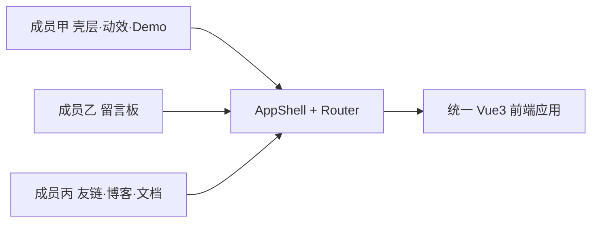

# GrunRay Wiki — 三人小组分工说明（示例稿）

> **课程范围**：Web 前端大作业（三人组，功能/页面按 ×3 折算）。  
> **说明**：后端 Flask/MySQL、导入脚本等 **不计入本表**；表中「接口对接」仅指前端 `services/*` 调用与页面联调。  
> **占位符**：请将「成员甲 / 乙 / 丙」替换为真实姓名、学号；占比可按答辩口径微调 ±3%。

---

## 一、分工总览

| 成员 | 角色定位 | 工作量占比（前端） | 一句话职责 |
|------|----------|-------------------|------------|
| **成员甲** | 项目负责人 · 核心前端 | **约 58%** | 全站壳层、视觉与动效体系、项目 Demo 容器机制、首页与项目详情架构 |
| **成员乙** | 业务模块前端 | **约 22%** | 留言板全流程（列表 / 发表 / 排序 / 站长审核与回复） |
| **成员丙** | 业务模块前端 + 文档 | **约 20%** | 友链展示与申请、博客/项目「内容消费」页、实验报告统稿与答辩素材 |

---

## 二、成员甲（主责）— 核心框架与难点

**承担原则**：课程评分中的「页面体验」「Vue 技术应用」「工程化」主要落点；**复杂交互与非常规实现集中在此**。

### 2.1 全站壳层与导航

| 交付物 | 路径 / 说明 |
|--------|-------------|
| 应用壳层（顶栏、溢出工具栏、页脚、子路由出口） | `frontend/src/components/layout/AppShell.vue` |
| 主导航与分组下拉 | `SiteNav.vue`、`SiteNavGroup.vue` |
| 日 / 夜 / 抽象主题切换 | `ThemeDayNightToggle.vue` |
| 页脚揭示面板 | `FooterGrunRayPanel.vue`、`composables/useFooterGrunRayReveal.ts` |
| 路由与全屏布局 meta | `frontend/src/router/index.ts` |
| 全局 UI 状态（主题、背景图、音乐最小化、光标轨迹开关） | `stores/ui.ts` |
| 主题 token 与全局样式 | `styles/main.css`、`styles/themes/*` |
| 按路由切换背景图 | `theme/pagePhotoBackgrounds.ts` |
| 部分路由「损坏/故障」视觉态 | `theme/pageCorruptState.ts`、`styles/themes/page-corrupt.css` |

**技术要点（报告可写）**：顶栏工具 **FLIP 位移动画**（`useHeaderToolbarLayoutShift.ts`）、滚动时导航 **compact**（`useNavScrollCompact.ts`）、溢出菜单与音乐按钮状态联动。

### 2.2 动效与交互体验（课程 CSS3 / JS 重点）

| 类别 | 路径 / 说明 |
|------|-------------|
| 页面入场动画体系 | `composables/usePageEnterAnimation.ts` + `styles/page-enter-*.css`（home / timeline / post / message / friends / xiqi 等） |
| GSAP 光标轨迹 | `components/layout/CursorTrail.vue` |
| 首页胶片流 | `components/media/FilmFeed.vue`（轨道动画、滚轮调速、灯箱查看） |
| 开屏蜗牛 overlay | `components/SplashWoniuOverlay.vue` |
| 浮动音乐播放器 | `components/music/FloatingMusicPlayer.vue`（拖拽、音量、localStorage 持久化） |
| 「栖息」分栏布局（列表 + 详情滑入，Xiqi） | `components/xiqi/XiqiSplitLayout.vue`、`useXiqiSplitFooter.ts`、`styles/page-xiqi.css` |
| 碎语 / 推荐 / 关于等全屏页动效 | `views/FragmentsView.vue`、`FragmentComposeView.vue`、`RecommendView.vue`、`AboutView.vue` 及对应 `page-enter-*` |

**技术要点**：`prefers-reduced-motion` 降级、双 `requestAnimationFrame` 避免入场动画丢帧、分栏关闭时 **保留详情占位防塌陷**（`FragmentsView` 中 `detailDisplayId` 等）。

### 2.3 项目 Demo 容器机制（数据驱动 + 构建管线）

| 环节 | 路径 / 说明 |
|------|-------------|
| 详情页 **layout 块注册表** | `project-blocks/registry.ts`、`ProjectBlockRenderer.vue` |
| Demo 块（iframe / srcdoc / sandbox） | `project-blocks/blocks/DemoBlock.vue` |
| 其它块类型 | `OverviewBlock`、`MarkdownBlock`、`GalleryBlock`、`ChangelogBlock`、`FallbackBlock` |
| 类型定义 | `types/content.ts` → `ProjectLayoutBlock` |
| 项目详情页组装 | `views/ProjectDetailView.vue` |
| Demo 子工程与配置 | `demos/*/demo.config.json`（如 `crsea-threejs`、`task-board`） |
| 构建并产出静态资源 | `demos/build-demo-assets.mjs`（`npm run build:demos`） |
| 导入说明（与 MD 中 `demo_url` / embed 字段配合） | 项目 import Markdown 中的 `layout` 配置 |

**技术要点（答辩可演示）**：项目在 Markdown 里配置 `layout: [{ type: demo, demoUrl: ... }]` → 构建脚本打包独立 demo → 详情页 **沙箱 iframe** 嵌入，实现「作品站中站」；无第三方 UI 库。

### 2.4 首页与项目/博客「框架级」页面

| 页面 | 路径 | 说明 |
|------|------|------|
| 首页 | `views/HomeView.vue` | 布局、外链复制、胶片流挂载 |
| 项目列表（时间轴 + 标签筛选） | `views/ProjectsView.vue` | 与博客列表同套时间轴交互模式 |
| 项目笔记列表 | `views/ProjectNotesView.vue` | |
| 博客列表框架 | `views/BlogView.vue` | 分类 / 标签 / 关键词筛选、时间轴（**业务文案与测数据**可与成员丙协作） |
| 文章详情框架 | `views/PostDetailView.vue` | Markdown 渲染、代码块复制（`useMarkdownCodeCopy.ts`） |
| 404 互动与隐藏主题 | `views/NotFoundView.vue`、`utils/corruptText.ts`、`theme/pageCorruptState.ts`、`styles/themes/page-corrupt.css` | 故障文案、全站 corrupt 态、解锁/应用抽象主题、重播故障、返回首页 |
| SEO 与 head | `composables/useSeoMeta.ts` | |
| 内容仓库封装 | `services/contentRepository.ts` | 项目/文章列表与详情 API 封装 |

### 2.5 成员甲 — 个人收获（报告节选示例）

- 掌握 Vue 3 组合式 API 下 **大型壳层组件** 的状态拆分与性能注意点。  
- 实践 **CSS 入场动画 + composable** 复用，以及 **GSAP** 与原生 CSS 动画的分工。  
- 设计并实现 **可扩展的 project layout 块系统** 与 **demo 构建嵌入链路**，便于作品集持续加项目。

---

## 三、成员乙 — 留言板模块

**模块目标**：满足大作业「表单录入、列表、排序、增删改查（审核）、交互反馈」等得分点。

| 任务 | 路径 / 说明 |
|------|-------------|
| 留言列表页 UI | `views/MessagesView.vue` |
| 留言 API 封装 | `services/messageApi.ts` |
| OAuth 登录入口（站长） | `services/messageAuth.ts`、`MessageAvatarWithProvider.vue` |
| 发表留言表单 | 正文校验、字数限制、验证码展示与刷新 |
| 排序 | `newest` / `oldest` |
| 站长能力 | 「待审核」Tab、`approve` / `reject`、回复 `createOwnerReply` |
| 用户反馈 | Toast、loading、错误提示 |
| 样式 | `styles/page-enter-message.css`、页面内 scoped 样式 |
| 中英文文案 | `i18n/locales/*.json` 中 `messages.*`（与成员甲协调 key） |

**与成员甲的接口**：使用统一 `playPageEnter`、壳层导航进入 `/messages`；**不修改** AppShell / 全局主题逻辑，仅消费。

**成员乙 — 个人收获（示例）**：表单校验与异步提交、列表与站长权限 UI 分支、与 REST API 联调经验。

---

## 四、成员丙 — 友链、博客/项目内容页、文档答辩

### 4.1 友链模块

| 任务 | 路径 / 说明 |
|------|-------------|
| 友链列表页 | `views/FriendsView.vue` |
| 友链申请页 | `views/FriendsApplyView.vue` |
| API 封装 | `services/friendsApi.ts` |
| 特殊友链头像/图标 | `components/friends/SpecialLinkAvatar.vue`、`SpecialLinkIcon.vue` |
| 申请页站点信息预览 | `config/friendsSiteProfile.ts`、favicon 工具 `utils/siteFavicon.ts` |
| 样式 | `styles/page-friends.css`、`page-enter-friends.css` |

### 4.2 博客 / 项目（内容侧协作）

| 任务 | 说明 |
|------|------|
| 博客筛选联调与测试 | 在 `BlogView.vue` 已有框架上完成 **分类 / 标签 / 关键词** 用例自测、截图 |
| 项目卡片文案 | 协助校对 `ProjectCard` 展示字段、标签与导入 MD 一致性 |
| 可选：碎语列表内容运营 | `FragmentsView` 列表数据展示与 mood 筛选（若时间紧，由成员甲兜底） |

### 4.3 文档与答辩（建议主笔）

| 任务 | 说明 |
|------|------|
| 实验报告统稿 | 依据 `报告.md` 目录，汇总三人「个人收获」、贴截图 |
| 分工表定稿 | 将本文档填入真实姓名学号，与答辩 PPT 一致 |
| 答辩视频剪辑 | 按 `要求.md` 第六节提纲：先演示壳层/首页/Demo，再演示留言、友链 |
| 运行说明 | 整理 `designed/Web_exp/BIG/运行说明.md`（前端 `npm run dev` + 后端启动一句，满足「能本地运行」） |

**成员丙 — 个人收获（示例）**：多步骤表单与验证码流程、友链展示组件化、软件工程文档撰写与演示编排。

---

## 五、协作边界（避免重复劳动）

| 事项 | 负责人 | 说明 |
|------|--------|------|
| 新增全局路由 | 成员甲 | 成员乙/丙提需求，由甲接入 `router/index.ts` 与 `SiteNav` |
| 新增 i18n key | 各模块负责人 | 在对应 `messages.*` / `friends.*` / `nav.*` 下添加，合并时解决冲突 |
| 修改 `AppShell` / 主题 / 动效 CSS | 成员甲 | 乙/丙不直接改壳层，避免冲突 |
| 留言 / 友链 API 字段变更 | 乙 / 丙分别维护 `*Api.ts` | 后端改动时各自更新类型与错误处理 |
| 项目 demo 新增 | 成员甲 | 在 `demos/` 增加子工程并跑 `build:demos`；乙/丙可在 MD 里写 `layout` |
| 实验报告「技术方案」章节 | 甲主写动效与 Demo；乙写留言；丙写友链与联调 | 丙统稿 |

---

## 六、与大作业评分项的对应（便于写报告）

| 评分项 | 主要贡献者 |
|--------|------------|
| 页面设计与用户体验 | **成员甲**（壳层、动效、首页胶片、分栏布局）+ 全员页面 |
| 功能完整性 | 乙（留言）+ 丙（友链）+ 甲（项目/博客/首页） |
| 前端技术应用 | **成员甲**（Vue Router/Pinia/CSS3 动画/GSAP/组件化） |
| 数据处理 | 乙（留言 CRUD + 审核）+ 丙（友链申请）+ 甲（筛选/缓存） |
| 工程规范 | 甲（目录与类型）+ 丙（README / 运行说明） |
| 设计文档 | **成员丙统稿**，三人各写一节 |
| 答辩展示 | 丙剪辑；甲演示 **Demo 嵌入 + 动效**；乙/丙各演示本模块 |

---

## 七、填写区（提交前替换）

| 字段 | 成员甲 | 成员乙 | 成员丙 |
|------|--------|--------|--------|
| 姓名 |  |  |  |
| 学号 |  |  |  |
| 联系电话 / 微信 |  |  |  |
| 签字（纸质报告如需） |  |  |  |

**确认**：三人已知晓各自模块与占比；复杂技术难点（壳层、动效、Demo 容器、项目 layout 块）归属 **成员甲**，与代码仓库实际情况一致。

---

*文档版本：2026-05-22 · 基于当前 `frontend/src` 路由与模块梳理。*
